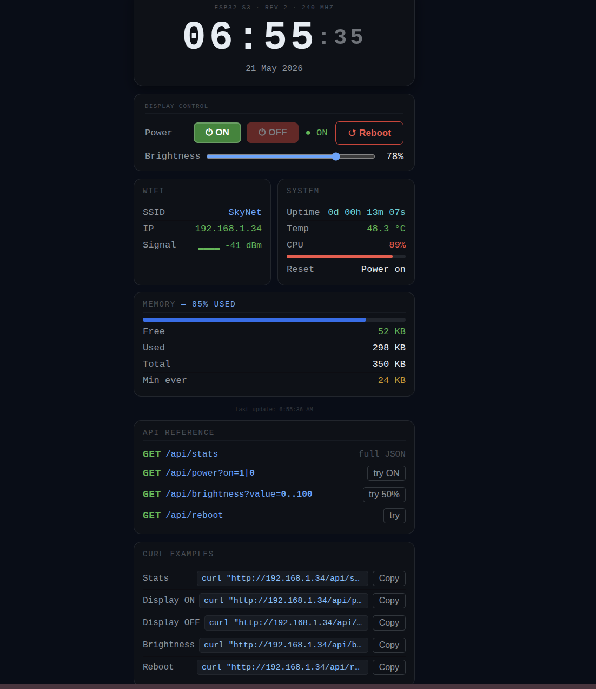

# ESP32-S3 Clock Display

Настольные часы на ESP32-S3 с TFT-дисплеем 3.5" и веб-дашбордом.


## Железо

| Компонент | Модель |
|-----------|--------|
| МК | ESP32-S3-N16R8 |
| Дисплей | 3.5" TFT SPI 480×320 (ILI9488) |
| Тач | XPT2046 (встроен в модуль дисплея) |

### Пины

| Дисплей | ESP32-S3 |
|---------|----------|
| VCC | 3V3 |
| GND | GND |
| CS | GPIO 10 |
| RESET | GPIO 8 |
| DC/RS | GPIO 9 |
| SCK | GPIO 12 |
| SDI (MOSI) | GPIO 11 |
| SDO (MISO) | GPIO 13 |
| LED (BL) | GPIO 3 |
| T_CS | GPIO 4 |
| T_IRQ | GPIO 2 |

## Структура проекта

```
src/
  main.cpp            — логика, дисплей, HTTP-сервер
  webpage.h           — встроенный HTML-дашборд
  DSEG7Classic_48.h   — шрифт DSEG7Classic (конвертирован из TTF)
platformio.ini
```

## Стек

- **Framework:** Arduino (ESP-IDF 5.x / Arduino-ESP32 3.x)
- **Дисплей:** [LovyanGFX](https://github.com/lovyan03/LovyanGFX) — нативная поддержка IDF 5.x
- **Шрифт:** DSEG7Classic-Regular ([keshikan/DSEG](https://github.com/keshikan/DSEG)), конвертирован Adafruit fontconvert
- **Время:** NTP через `configTzTime()`

> **Почему LovyanGFX, а не TFT_eSPI?**  
> TFT_eSPI 2.5.x несовместим с Arduino-ESP32 3.x / IDF 5.x — крашится при `tft.init()` с `StoreProhibited` на адресе `0x10`. LovyanGFX поддерживает IDF 5.x нативно.

## Быстрый старт

**1. Зависимости**

```ini
# platformio.ini
lib_deps =
    lovyan03/LovyanGFX
```

**2. Настройки** — отредактируй в `main.cpp`:

```cpp
#define WIFI_SSID  "your_network"
#define WIFI_PASS  "your_password"
#define TZ_STRING  "CET-1CEST,M3.5.0,M10.5.0/3"  // часовой пояс
```

Строки для других зон: [список POSIX TZ](https://github.com/nayarsystems/posix_tz_db/blob/master/zones.csv)

**3. Прошивка**

```bash
pio run --target upload --upload-port /dev/ttyACM0
pio device monitor --port /dev/ttyACM0
```

После старта Serial выведет IP-адрес — открой в браузере.

## Что показывает экран

```
┌─────────────────────────────────────────────────────┐
│                                                     │
│              06-45-22   ← DSEG7 7-сегмент           │
│                                                     │
├─────────────────────────────────────────────────────┤
│  21 May 2026      192.168.1.34          SkyNet      │
└─────────────────────────────────────────────────────┘
```

## Веб-дашборд

Открой `http://<ip>/` в браузере.

Показывает: время, дату, WiFi (SSID, IP, RSSI), uptime, температуру CPU, загрузку CPU, RAM. Управление подсветкой и питанием экрана.



## HTTP API

| Метод | Эндпоинт | Описание |
|-------|----------|----------|
| GET | `/api/stats` | Полный JSON со статусом |
| GET | `/api/power?on=1\|0` | Включить / выключить экран |
| GET | `/api/brightness?value=0..100` | Яркость подсветки |
| GET | `/api/reboot` | Перезагрузка |

**Примеры:**

```bash
# Статус
curl "http://<your_ip_address>/api/stats"

# Выключить экран
curl "http://<your_ip_address>/api/power?on=0"

# Яркость 50%
curl "http://<your_ip_address>/api/brightness?value=50"

# Перезагрузка
curl "http://<your_ip_address>/api/reboot"
```

## Serial Monitor

Каждые 10 секунд выводит сводку:

```
─────────────────────────────────
  Time    : 06:45:22  21.05.2026
  Uptime  : 0d 00h 13m 07s
  WiFi    : SkyNet  192.168.1.34  -41 dBm
  Temp    : 48.3 C
  CPU     : 89%
  Heap    : 52000 free / 350000 total  (min ever 24000)
  Display : ON  brightness 78%
─────────────────────────────────
```

## Шрифт для качественного OCR: DSEG7Classic

`DSEG7Classic_48.h` уже включён в проект.


## Лицензия

MIT

## Setup:
  - esp32-s3-N16R8
  - 3.5" TFT SPI
  - microcontroller contacts: 
    - bottom row from left to right: 3V3, 3V3, RST, 4, 5, 6, 15, 16, 17, 18, 8, 3, 46, 9, 10, 11, 12, 13, 14, 5V, GND
    - top row from left to right: GND, TX, RX, 1, 2, 42, 41, 40, 39, 38, 37, 36, 35, 0, 45, 48, 47, 21, 20, 19, GND, GND
  - esp32-s3 is connected to the display by the following pins: 
    - bottom row first pin 3V3 + VCC
    - top row first pin GND + GND of the screen
    - bottom row pin 10 + CS
    - bottom row pin 8 + RESET
    - bottom row pin 9 + DC\RSy
    - bottom row pin 12 + SCK+T_CLK
    - bottom row pin 11 + SDI(MOSI)+T_DIN
    - bottom row of pin 3 + LED
    - bottom row of pins 13 + SDO(MISO)+T_DO
    - bottom row pin 4 + T_CS
    - top row pin 2 + T_IRQ
    - SD card pin (SD_CS, SD_MOSI, SD_MISO, SD_SCK) has not been connected yet.
